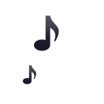

<h1 align="center"> >  Привет, меня зовут Егор_ </h1>

- 📭 [**`Связаться со мной`**](https://t.me/endygamedev)
- 🌐 [**`Сайт`**](https://endygamedev.github.io)
- 👨‍💻 [**`Gist`**](https://gist.github.com/endygamedev)

<h2> >>  Технологии_ </h2>

                  

<h2> >>  Статистика GitHub_ </h2>

  
  

<h3> >>>  Let's get this party_ </h3>
 
 

  
  
  

   

  | <a href="https://endygamedev.github.io"> 👨‍💻 endygamdev </a>  / 2019-2021  |

