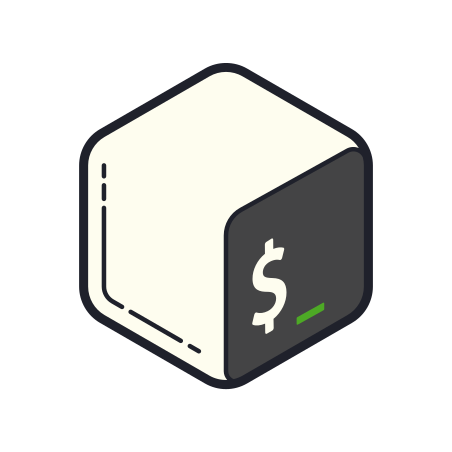
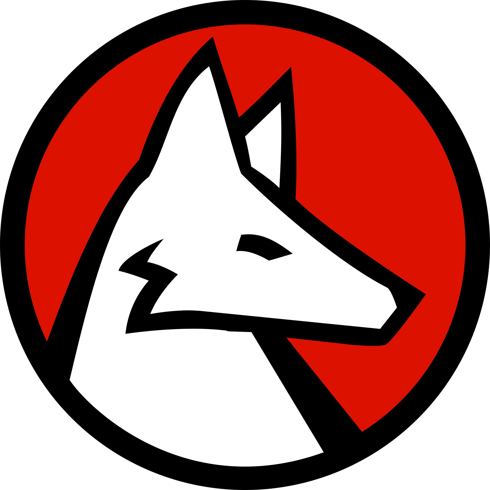
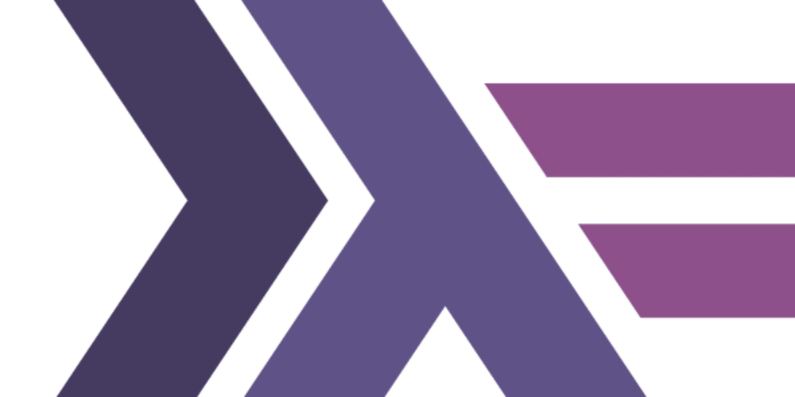
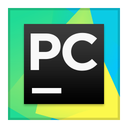
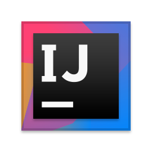
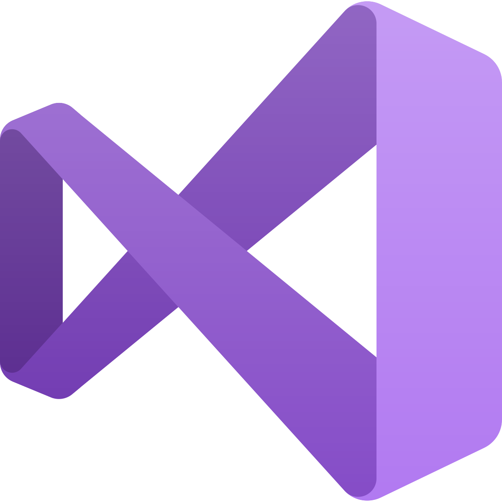

<h3 align="center"> >  Yo there! My name is Egor_ </h3>

  <kbd></kbd> 
  <kbd></kbd>
  <kbd></kbd>
  <kbd></kbd>

  
    <kbd>:cloud: <i>Study at <a href="https://unecon.ru/">Saint-Petersburg State University of Economics</a> on `Applied mathematics and computer science`</i></kbd>
  

  
    <kbd>:cloud:<i> tryin' to do something funny</i></kbd>
  

  

<b> >> technology stack_</b>

 
<table width="200%">
   <tr>
     <td> <h6 align="center"> &nbsp; &nbsp; &nbsp; &nbsp; &nbsp; &nbsp; &nbsp; &nbsp; &nbsp; &nbsp; &nbsp; &nbsp; &nbsp; &nbsp; &nbsp; &nbsp; &nbsp; &nbsp; &nbsp; &nbsp; &nbsp; &nbsp; &nbsp;&nbsp; &nbsp; &nbsp; &nbsp; programming laguages &nbsp; &nbsp; &nbsp; &nbsp; &nbsp; &nbsp; &nbsp; &nbsp; &nbsp; &nbsp; &nbsp; &nbsp; &nbsp; &nbsp; &nbsp; &nbsp; &nbsp; &nbsp; &nbsp; &nbsp; &nbsp; &nbsp; &nbsp;&nbsp; &nbsp; &nbsp; &nbsp; &nbsp; &nbsp; </h6>  </td>
     <td> <h6 align="center"> &nbsp; &nbsp; &nbsp; &nbsp; &nbsp; &nbsp; &nbsp; &nbsp; &nbsp; &nbsp; &nbsp; &nbsp; &nbsp; &nbsp; &nbsp; &nbsp; &nbsp; &nbsp; &nbsp; &nbsp; &nbsp; &nbsp; &nbsp; &nbsp;&nbsp; &nbsp; &nbsp; frameworks &nbsp; &nbsp; &nbsp; &nbsp; &nbsp; &nbsp; &nbsp; &nbsp; &nbsp; &nbsp; &nbsp; &nbsp; &nbsp; &nbsp; &nbsp;&nbsp; &nbsp; &nbsp; &nbsp; &nbsp; &nbsp; &nbsp; &nbsp; &nbsp; &nbsp; &nbsp; &nbsp; &nbsp; &nbsp; &nbsp;  </h6> </td>
   </tr>
    <tr>
     <td>
       

          <kbd></kbd>
          <kbd></kbd>
          <kbd></kbd>
          <kbd></kbd>
          <kbd></kbd>
          <kbd></kbd>
          <kbd></kbd>
          <kbd></kbd>
       

    </td>
    <td>
      

        <kbd></kbd>
        <kbd></kbd>
        <kbd></kbd>
        <kbd></kbd>
      
  
    </td>
  </tr>
  <tr>
     <td> <h6 align="center"> layout </h6> </td>
     <td> <h6 align="center"> databases </h6> </td>
  </tr>
  <tr>
    <td>
      

        <kbd></kbd>
        <kbd></kbd>
        <kbd></kbd>
        <kbd></kbd>
      

    </td>
    <td>
      

        <kbd></kbd>
        <kbd></kbd>
      

    </td>
  </tr>
  <tr>
     <td colspan="2"> <h6 align="center"> environments </h6> </td>
  </tr>
  <tr>
    <td colspan="2">
      

        <kbd></kbd>
        <kbd></kbd>
        <kbd></kbd>
        <kbd></kbd>
        <kbd></kbd>
        <kbd></kbd>
        <kbd></kbd>
        <kbd></kbd>
        <kbd></kbd>
        <kbd></kbd>
        <kbd></kbd>
      

    </td>
  </tr>
</table>

<b>>>  statistics_</b>

 

  
  

  

  
<b> >>>  let's get this party_ </b>
  

  
   
  

   

  | <a href="http://bronnikov.space"> 👨‍💻 endygamedev </a>  / 2019-2021  |

